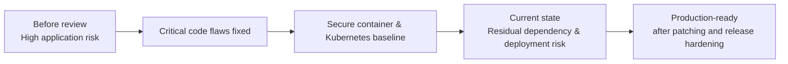
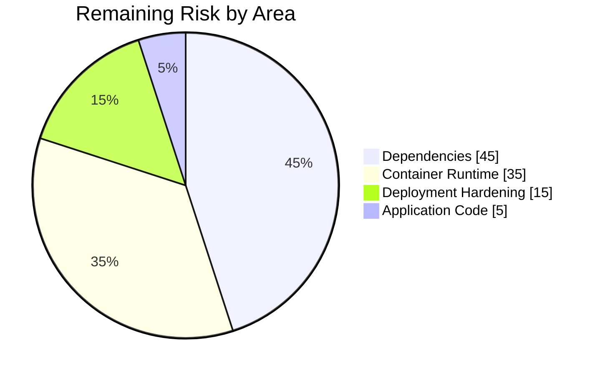

# Executive Summary

> **Decision:** VulnTracker is significantly safer after remediation, but I would **not approve production deployment yet**. The remaining blockers are dependency patching, container refresh, and final deployment hardening.

## Security Posture at a Glance

| Area | Before | After | Current Risk |
|---|---|---|---|
| Authentication | Unsigned JWT mode accepted | Strict signed-token validation | 🟡 Medium |
| Database access | SQL injection possible | Parameterised / ORM queries | 🟢 Low |
| User data isolation | Cross-user scan access possible | Ownership checks enforced | 🟢 Low |
| Credential handling | Passwords logged | Secrets removed from logs | 🟢 Low |
| Share links | New feature required security controls | Expiry, hashed tokens, password controls, rate limiting | 🟢 Low |
| Secrets | Hardcoded in source | Runtime / external secret management | 🟢 Low |
| Dependencies | Multiple known vulnerabilities | Some code fixes completed, package upgrades pending | 🔴 High |
| Container image | Vulnerable base/runtime packages | Hardened container, patching still required | 🔴 High |
| Kubernetes | No deployment artefacts | Non-root, limits, seccomp, NetworkPolicy, external secrets | 🟡 Medium |

### Posture change

---

## What Changed

The review removed the most serious application-level weaknesses:

- **Authentication hardened** — unsigned JWTs are no longer accepted.
- **SQL injection removed** — search queries now use safe database access.
- **User isolation enforced** — users can only retrieve their own scan records.
- **Credential exposure reduced** — passwords and reusable secrets are no longer written to logs.
- **Share links hardened** — tokens are random, stored as hashes, expire automatically, and password attempts are limited.
- **Secrets moved out of source code** — deployment secrets are supplied at runtime.
- **Deployment baseline improved** — the container runs as non-root and Kubernetes applies restrictive security controls.

---

## Top 3 Residual Risks

| Priority | Residual Risk | Why It Matters | Why Not Fully Remediated |
|---|---|---|---|
| **1** | **Outdated authentication, cryptography and request-processing libraries** | These components sit close to login and HTTP request handling. A vulnerable dependency can undermine otherwise secure code. | Safe upgrades require compatibility testing across several tightly coupled packages. |
| **2** | **Critical / High vulnerabilities in the container image** | The runtime still includes vulnerable OS packages such as OpenSSL and SQLite. | These are inherited from the selected base image and require a rebuild on a patched image followed by regression testing. |
| **3** | **Production deployment integrity is incomplete** | The Kubernetes image is not yet pinned by digest and namespace isolation can be improved. | The assignment uses a local image and does not include a real registry or production cluster. |

---

## Risk Concentration

The important shift is that **risk is no longer concentrated in obvious application-code flaws**. The remaining exposure is primarily operational: dependency freshness, base-image patching and production release controls.

---

## Recommended Next Steps

| Order | Action | Outcome |
|---|---|---|
| **1** | Upgrade `python-jose`, cryptography, FastAPI/Starlette and multipart dependencies | Removes the highest remaining application-library risk |
| **2** | Rebuild on a current patched Python 3.11 slim base image | Removes known Critical / High OS package vulnerabilities |
| **3** | Pin the production image by immutable digest | Ensures the deployed image is exactly the image that was scanned and approved |
| **4** | Deploy into a dedicated Kubernetes namespace | Improves isolation, RBAC and policy enforcement |
| **5** | Add security gates to CI/CD | Prevents vulnerable code, dependencies, images or IaC from reaching production |
| **6** | Add rate limiting, monitoring and alerting | Improves resilience against credential attacks and abuse |
| **7** | Rotate any secret previously committed to source control | Removes residual risk from repository history |
| **8** | Perform a focused pre-production penetration test | Validates authentication, authorisation, share links and tenant isolation in the real environment |

---

## CISO Takeaway

**Before:** the application contained exploitable flaws in authentication, database access, access control and credential handling.

**Now:** the highest-impact code issues are fixed and the deployment design has a solid security baseline.

**Remaining blocker:** dependency and container patching must be completed before production approval.

### Recommended decision

> **Conditional approval only.** Proceed toward production once dependency upgrades, container rebuild, immutable image pinning and final deployment validation are completed.
